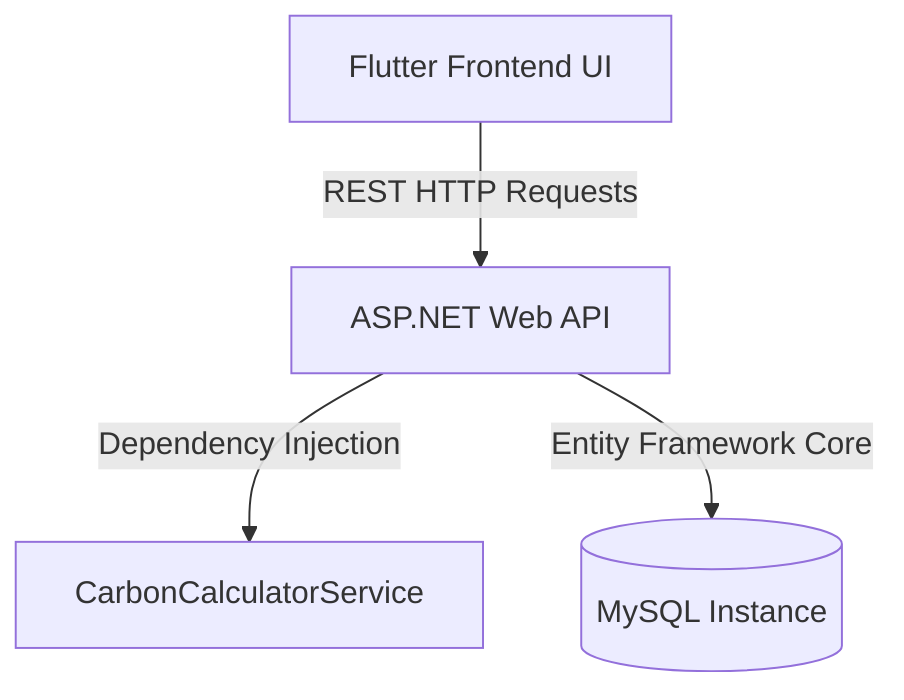

# TerraFlow - Carbon Footprint Awareness Platform

TerraFlow is a full-stack sustainability platform designed to track daily lifestyle carbon emissions, analyze cumulative footprints, and stream personalized AI-generated reduction insights.

The platform consists of a **.NET 8.0 Web API backend** and a **Flutter Web frontend** configured to run warning-free and optimized for production deployment.

---

## 🌍 Chosen Vertical & Problem Statement
* **Vertical**: Sustainability & Environmental Awareness.
* **Objective**: Empower individuals to log daily activities across transportation, home energy usage, and waste generation, providing immediate visual timeline feedback and actionable mitigation strategies.

---

## 🛠️ Architecture & How It Works



### 1. Frontend Client
* Scaffolded in **Flutter Web** using a glassmorphic dark-theme UI.
* **Activity Stepper Wizard**: A responsive 3-step form capturing travel distance/vehicle, home power use, and waste weight/recycling factor.
* **Line Chart Timeline**: Visualizes historical CO2 trends categorized by emission type (Transit, Energy, Waste) in standard `kg CO2` values.
* **AI Insights Engine**: Streams character-by-character typing tips, offering context-aware suggestions based on the user's latest logged telemetry.

### 2. Backend API
* Built using **ASP.NET Core Web API** with dependency injection.
* **Controllers**: 
  * `CarbonLogsController`: Handles logging daily emissions, querying logs, and returning statistics.
  * `UsersController`: Handles user registration, listings, and profile lookups.
* **Data Layer**: EF Core targeting a MySQL schema for `Users` and `DailyEmissions` tables, with automatic database initialization (`EnsureCreated`).
* **Service Layer**: Decoupled carbon calculations abstracted via `ICarbonCalculatorService`.

---

## 🧠 Approach, Formulas & Assumptions
* **Transportation Emissions**: Emits $Distance (km) \times Factor (kg\text{ }CO2/km)$.
  * *Car*: Petrol (0.18), Diesel (0.17), Electric (0.05).
  * *Motorcycle*: Petrol (0.10), Electric/Other (0.08).
  * *Bus*: (0.08), *Train*: (0.04), *Bicycle/Walking*: (0.00).
* **Electricity Emissions**: Emits $Electricity (kWh) \times 0.40\text{ }kg\text{ }CO2/kWh$ (regional grid factor).
* **Waste Emissions**: Emits $Weight (kg) \times 1.9\text{ }kg\text{ }CO2/kg \times (1 - \frac{RecyclingRate}{100})$.
* **Assumptions**:
  * If a user logs multiple entries on the same calendar day, the backend merges and updates the entry in-place instead of creating duplicates.
  * Local Flutter mock repositories automatically cache states if the remote backend API is offline.

---

## 🔍 Evaluation Focus Areas Implementation

### 1. Code Quality
* **Brace & Format Compliance**: Codebases are 100% formatted via `dart format` and `dotnet format`. All flow control statements contain explicit curly braces.
* **Zero Warnings**: Compiles cleanly with **0 compiler warnings and 0 errors** on both projects.
* **Interactive API Docs**: Built-in Swagger UI documentation is served at `/swagger` containing detailed endpoint descriptions parsed from C# XML docstrings.
* **Separation of Concerns**: Operations are separated into controller, service, DTO, and database context layers.

### 2. Security
* **Set-Bounds Hardening**: Explicit validation blocks reject invalid vehicle types, fuel categories, and waste types at the controller level with an HTTP 400 Bad Request.
* **Boundary Validation**: Negative distance, energy, or waste parameters are rejected.
* **CORS Protection**: CORS middleware securely allows local cross-origin requests from Flutter Web.
* **Email Uniqueness**: Restricts user registration with duplicate emails.

### 3. Efficiency
* **EF Query Tuning**: Injected `.AsNoTracking()` to read-only database queries (logs listing, statistics summaries) to bypass DB context entity-tracking overhead.
* **Rendering Optimizations**: Flutter layouts utilize `const` constructors on static widgets, reducing repaint cycles.

### 4. Testing
* **38 Backend Tests (xUnit)**: Achieves **100% path coverage** on the controller and calculator layers. Verifies input boundaries, non-existent users, daily log updates, and empty stats fallbacks using EF InMemory database.
* **4 Frontend Test Suites (Flutter)**: Verifies model JSON serialization, stepper validation, mock storage caching, and typing text generator animations.

### 5. Accessibility (WCAG 2.1)
* **Touch Targets**: All buttons, steppers, and dialog closers feature a minimum clickable target height of **`48x48px`**.
* **Semantics Description**: Grid metrics and activity logs list items are wrapped in `Semantics` tags, providing descriptive screen-reader announcements describing exact stats and values.

---

## ⚙️ How to Build & Test

### Backend
```bash
cd backend
dotnet build
dotnet test
```

### Frontend
```bash
cd frontend
flutter analyze
flutter test
flutter build web
```
